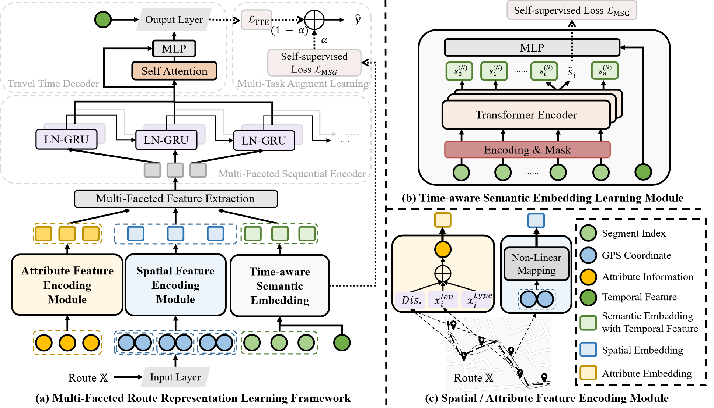

# [IEEE T-ITS Submission for Regular Paper] Multi-faceted Route Representation Learning for Travel Time Estimation

This is a PyTorch implementation of Multi-faceted Route Representation Learning for Travel Time Estimation (MulT-TTE). 



## Requirements

```
pip install -r requirements.txt
```

## Data

We conduct our experiments on two real-world taxi trajectory datasets and their corresponding road networks, including [**Chengdu**](https://challenge.datacastle.cn/v3/cmptDetail.html?id=175) and [**Porto**](https://www.kaggle.com/datasets/crailtap/taxi-trajectory). And the Map Matching Algorithm with corresponding road network information are referenced [here](https://fmm-wiki.github.io/).

The sampled data and corresponding network information are stored in the following directory:
- `MulT-TTE/data/chengdu/...`
- `MulT-TTE/data/chengdu/network-chengdu/...`

## Run
The command of processing is listed bellow: 
```
(base) PS \MulT-TTE> python .\main.py --help
usage: main.py [-h] [-m {MulT_TTE}] [-M {train,resume,test}]
               [-d {chengdu_MulT_TTE,porto_MulT_TTE}] [-i IDENTIFY]
               [-D DEVICE] [-o {Adam}] [-c {rmse,mse,mape,mae,smoothL1}]
               [-cl LOSS_VAL] [-e EPOCHS] [-b BETA] [-l LR] [-w WEIGHT_DECAY]
               [-p PATIENCE] [-r MASK_RATE]

optional arguments:
  -h, --help            show this help message and exit
  -m {MulT_TTE}, --model {MulT_TTE}
                        input the model name
  -M {train,resume,test}, --mode {train,resume,test}
                        input the process mode
  -d {chengdu_MulT_TTE,porto_MulT_TTE}, --dataset {chengdu_MulT_TTE,porto_MulT_TTE}
                        input the dataset name
  -i IDENTIFY, --identify IDENTIFY
                        input the specific identification information
  -D DEVICE, --device DEVICE
                        input the chosen device
  -o {Adam}, --optim {Adam}
                        input the chosen optimization function
  -c {rmse,mse,mape,mae,smoothL1}, --loss {rmse,mse,mape,mae,smoothL1}
                        input the chosen loss function
  -cl LOSS_VAL, --loss_val LOSS_VAL
                        intput the specific parameter for smoothL1
  -e EPOCHS, --epochs EPOCHS
                        input the max epochs
  -b BETA, --beta BETA  intput the learning preference between MSG and TTE
                        (the bigger the value, the more preference for TTE.)
  -l LR, --lr LR        intput the initial learning rate
  -w WEIGHT_DECAY, --weight_decay WEIGHT_DECAY
                        intput the weight decay of optimization
  -p PATIENCE, --patience PATIENCE
                        intput the max iteration times of early stop
  -r MASK_RATE, --mask_rate MASK_RATE
                        intput the mask rate of segments in a trajectory

```
For example, you can train the model through the following commands: 
```
python .\main.py --model MulT_TTE --dataset chengdu_MulT_TTE --identify example_0 --device cuda:0   

python .\main.py --model MulT_TTE --dataset porto_MulT_TTE --identify example_1 --device cuda:1   
```

## ~~Cite~~ (coming soon)

~~If you find the paper useful, please cite as following:~~

```
@inproceedings{,
  title={},
  author={},
  booktitle={},
  year={},
  organization={}
}
```
